# Grafana Dashboard Metrics Reference Guide

This guide explains each Grafana dashboard panel, covering PromQL queries, calculations, and practical meanings. The dashboard monitors both system resources (CPU, memory, disk, network) and application performance (HTTP requests, database queries) to provide complete visibility into your Node.js application's health and performance.

## **Application Health Overview**

### Panel 1: Availability %
```promql
100 * (sum(rate(http_requests_total{status_code!~"5.."}[5m])) / sum(rate(http_requests_total[5m])))
```

**PromQL Explanation**: This query uses the `http_requests_total` counter metric with label filtering to separate successful requests from server errors. The `status_code!~"5.."` filter excludes all HTTP status codes starting with 5 (500, 502, 503, etc.) using regex pattern matching. The `rate()` function calculates the per-second rate of requests over a 5-minute window, and `sum()` aggregates across all application instances. Finally, it divides successful requests by total requests and multiplies by 100 for percentage.


**How it's calculated**: The system counts all HTTP requests received in the last 5 minutes, then separates them into successful (status codes 200, 201, 404, etc.) and failed (status codes 500, 502, 503, etc.) categories. It calculates what percentage of total requests were successful by dividing successful requests by total requests and converting to percentage.

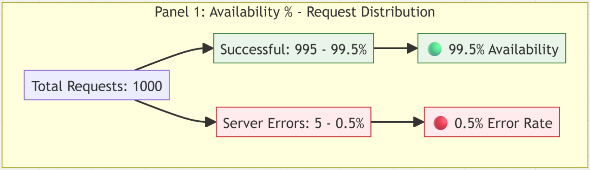

**Numerical Example**: If your application received 1000 requests in 5 minutes where 995 were successful (status codes 200, 201, 404) and 5 failed with server errors (status codes 500, 502), the calculation would be: (995 ÷ 1000) × 100 = 99.5% availability.

**What it means**: This represents your application's uptime and reliability from the user's perspective. It shows what percentage of user requests your application successfully processes without server-side failures. A value of 99.5% means that 99.5% of users get a proper response (even if it's a 404 error), while 0.5% experience server failures.

### Panel 2: Requests Per Second (RPS)
```promql
sum(rate(http_requests_total[1m]))
```

**PromQL Explanation**: This query uses the `rate()` function on the `http_requests_total` counter to calculate how many requests per second the application is receiving over a 1-minute time window. The `sum()` function aggregates the rates from all application instances or processes to give a total system-wide request rate.

**How it's calculated**: The system counts all HTTP requests received in the last minute, then divides by 60 to get requests per second. If you have multiple application instances, it adds up the rates from each instance to get the total system throughput.

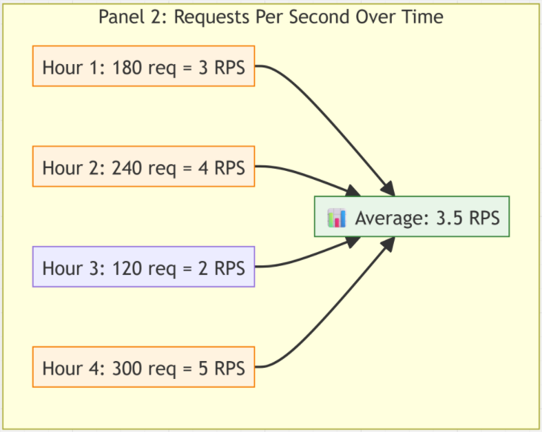

**Numerical Example**: If your application received 180 requests in the last minute, the calculation is 180 ÷ 60 = 3 RPS. With multiple instances: if Instance A handles 120 requests/minute (2 RPS) and Instance B handles 60 requests/minute (1 RPS), the total is 3 RPS.

**What it means**: This shows the current traffic load and user activity on your application. Higher values indicate more users are actively using your system, while sudden drops might indicate problems or reduced user engagement.

### Panel 3: Request Latency P99
```promql
histogram_quantile(0.99, rate(http_request_duration_seconds_bucket[5m]))
```

**PromQL Explanation**: This query uses histogram data stored in buckets (`http_request_duration_seconds_bucket`) and applies the `histogram_quantile()` function to calculate the 99th percentile. The `rate()` function normalizes the histogram buckets over 5 minutes, and `histogram_quantile(0.99, ...)` finds the value below which 99% of observations fall.

**How it's calculated**: The system collects response time measurements for all requests over 5 minutes, sorts them from fastest to slowest, then finds the value at the 99th percentile position. This means 99% of requests were faster than this time, and only 1% were slower.

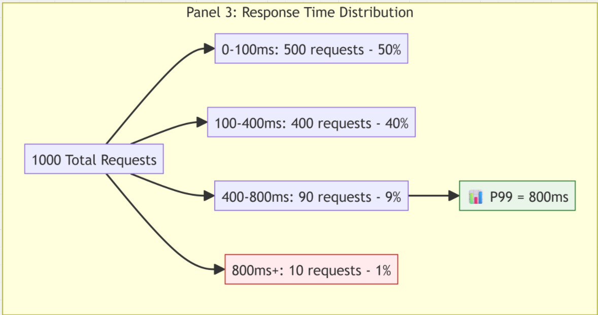

**Numerical Example**: If you had 1000 requests with response times ranging from 50ms to 3000ms, the P99 latency would be the response time of the 990th request when sorted from fastest to slowest. If that request took 800ms, then 99% of users experienced response times under 800ms.

**What it means**: This represents the worst-case response time that most users experience. Unlike average response times which can hide outliers, P99 shows you the experience of your slowest users, which is crucial for user satisfaction.

### Panel 4: DB Connection Count
```promql
db_connections_active
```

**PromQL Explanation**: This is a simple gauge metric that directly reports the current number of active database connections from your application to PostgreSQL. It's an instantaneous measurement without any time-based calculations or aggregations.

**How it's calculated**: The application's database connection pool reports how many connections are currently open and actively being used for database operations. This is a real-time count that changes as requests create and release database connections.

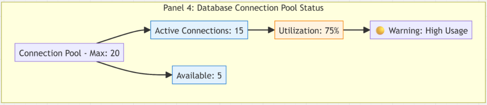

**Numerical Example**: If your connection pool is configured with a maximum of 20 connections and this metric shows 15, it means 15 connections are currently active, with 5 connections available for new requests.

**What it means**: This shows how much of your database connection capacity is being used. Database connections are limited resources, and running out can cause new requests to fail or wait, leading to application timeouts.

## **Enhanced CPU Metrics**

### Panel 5: CPU Usage %
```promql
100 - (avg(rate(node_cpu_seconds_total{mode="idle"}[5m])) * 100)
```

**PromQL Explanation**: This query uses the `node_cpu_seconds_total{mode="idle"}` metric which tracks cumulative CPU time spent in idle state. The `rate()` function calculates how much time per second the CPU was idle over 5 minutes, `avg()` averages across all CPU cores, multiplying by 100 converts to percentage, and subtracting from 100 gives the busy percentage.

**How it's calculated**: The system measures how much time each CPU core spends idle (doing nothing) over 5 minutes, averages across all cores, then subtracts from 100% to determine how much time the CPU was actively working. This accounts for time spent in user mode, system mode, and I/O wait.

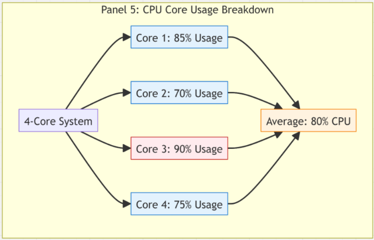

**Numerical Example**: If your 4-core CPU spent an average of 20% time idle across all cores over 5 minutes, the calculation would be: 100 - 20 = 80% CPU usage. This means the CPU was busy 80% of the time and idle 20% of the time.

**What it means**: This represents how much of your CPU processing power is being utilized. Higher percentages indicate your CPU is working harder to handle the current workload, while lower percentages suggest available capacity.

### Panel 6: Load Average 1m
```promql
node_load1
```

**PromQL Explanation**: This is a direct gauge metric from the Linux kernel that reports the 1-minute load average. It's not calculated but rather reported directly by the operating system as a standard Unix/Linux metric representing system load.

**How it's calculated**: The operating system counts the number of processes that are either currently running on the CPU or waiting in the run queue to be executed, then calculates the average over the past 1 minute. This includes processes in both runnable and uninterruptible sleep states.

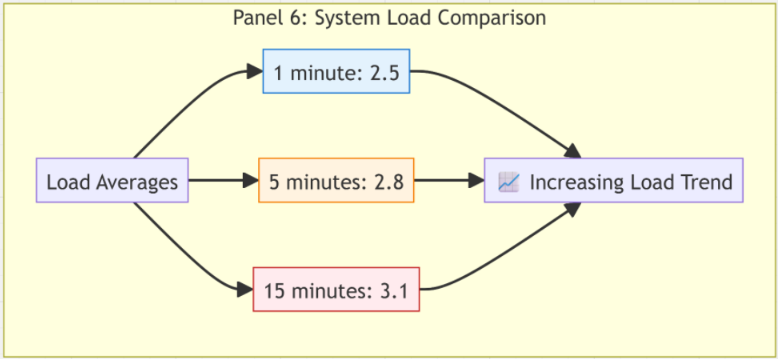

**Numerical Example**: On a 4-core server, a load average of 2.0 means on average 2 processes were competing for CPU time, indicating 50% utilization. A load of 4.0 would mean 100% utilization, and 6.0 would mean 150% utilization with processes waiting.

**What it means**: Load average represents system demand relative to available CPU resources. It indicates not just current CPU usage but also the queue of work waiting to be processed. Unlike CPU percentage, load average can exceed 100% when processes are waiting.

### Panel 7: Context Switches/sec
```promql
rate(node_context_switches_total[5m])
```

**PromQL Explanation**: This query uses the `node_context_switches_total` counter metric that tracks the cumulative number of context switches since system boot. The `rate()` function calculates how many context switches are occurring per second over a 5-minute window.

**How it's calculated**: The operating system counts every time the CPU scheduler switches execution from one process or thread to another. The rate function takes the difference between the current count and the count 5 minutes ago, then divides by 300 seconds to get switches per second.

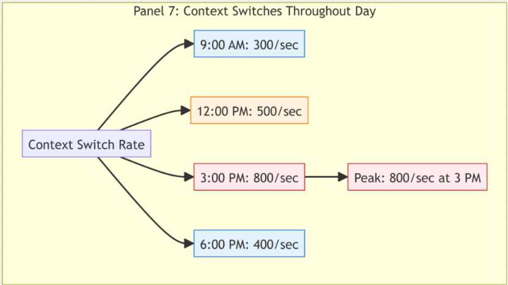

**Numerical Example**: If the context switch counter increased from 1,000,000 to 1,150,000 over 5 minutes (300 seconds), the rate would be: (1,150,000 - 1,000,000) ÷ 300 = 500 context switches per second.

**What it means**: Context switches occur when the CPU stops executing one process and starts executing another. Some context switching is normal and necessary for multitasking, but excessive switching creates overhead that reduces overall system performance.

### Panel 8: CPU I/O Wait %
```promql
avg(rate(node_cpu_seconds_total{mode="iowait"}[5m])) * 100
```

**PromQL Explanation**: This query uses the `node_cpu_seconds_total{mode="iowait"}` metric which tracks cumulative CPU time spent waiting for I/O operations. The `rate()` function calculates the per-second rate over 5 minutes, `avg()` averages across all CPU cores, and multiplying by 100 converts to percentage.

**How it's calculated**: The system measures how much time the CPU spends idle specifically because it's waiting for disk reads, disk writes, or network I/O to complete. This is different from regular idle time because the CPU wants to work but is blocked waiting for data.

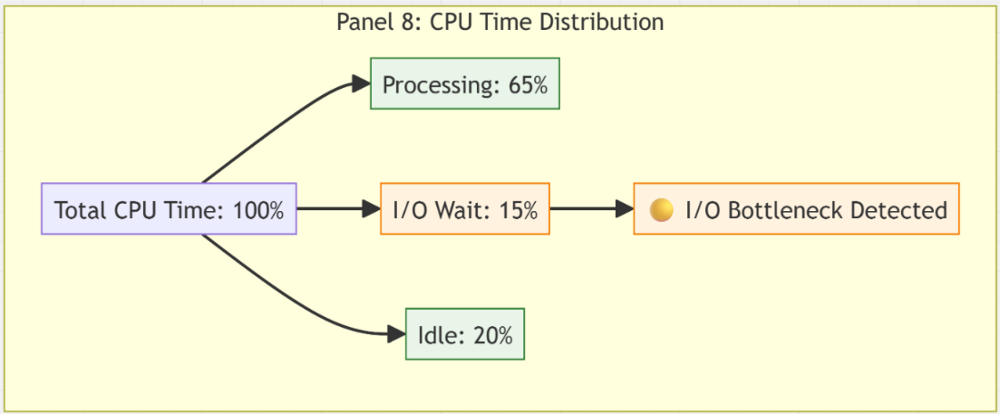

**Numerical Example**: If your CPU spent 15% of its time over 5 minutes waiting for disk operations to complete, this metric would show 15%. This means for every 100 seconds, 15 seconds were spent waiting for storage or network I/O.

**What it means**: High I/O wait indicates your CPU is ready to process data but is bottlenecked by slow storage or network operations. The CPU is essentially idle not by choice, but because it's waiting for data to arrive from slower components.

## **Enhanced Memory Metrics**

### Panel 9: Memory Usage %
```promql
100 * (1 - ((node_memory_MemAvailable_bytes or node_memory_MemFree_bytes) / node_memory_MemTotal_bytes))
```

**PromQL Explanation**: This query uses several memory metrics: `node_memory_MemTotal_bytes` for total memory, and either `node_memory_MemAvailable_bytes` (preferred) or `node_memory_MemFree_bytes` as fallback for available memory. The `or` operator provides fallback logic, and the calculation determines used memory as a percentage of total.

**How it's calculated**: The system takes total installed memory, subtracts memory that's available for new processes (including reclaimable cache), divides by total memory, and multiplies by 100 for percentage. Available memory is more accurate than free memory because it includes memory that can be quickly reclaimed from caches.

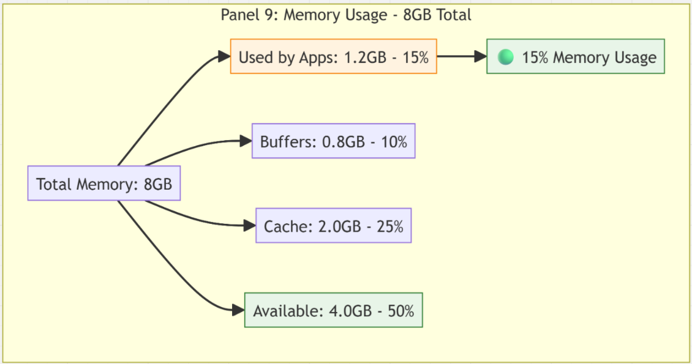

**Numerical Example**: With 8GB total memory where 6.8GB is available for use, the calculation would be: (1 - (6.8GB ÷ 8GB)) × 100 = (1 - 0.85) × 100 = 15% memory usage. This means 15% is actively used and 85% is available.

**What it means**: This represents how much of your server's RAM is currently being used by applications and the operating system. Unlike simple "free memory," this accounts for memory that appears used but can be reclaimed when needed (like file system caches).

### Panel 10: Total Memory
```promql
node_memory_MemTotal_bytes
```

**PromQL Explanation**: This is a simple gauge metric that directly reports the total amount of physical RAM installed in the system as reported by the Linux kernel. It's a static value that doesn't change unless hardware is modified.

**How it's calculated**: The operating system detects the total amount of physical RAM during boot and reports this value. No calculation is performed; it's a direct hardware specification reading converted to bytes.

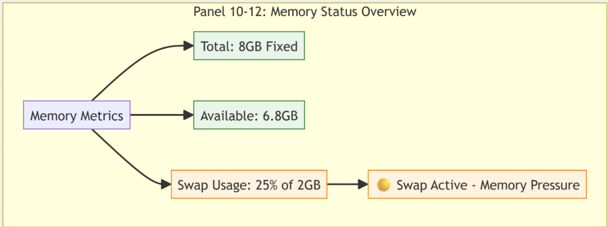

**Numerical Example**: If your server has 8GB of RAM installed, this metric would report 8,589,934,592 bytes (8 × 1024 × 1024 × 1024 bytes). Grafana can display this as "8.0 GB" using appropriate units.

**What it means**: This shows the maximum memory capacity of your server hardware. It represents the absolute limit of how much data can be stored in RAM simultaneously before the system must use slower storage methods like swap space.

### Panel 11: Available Memory
```promql
node_memory_MemAvailable_bytes
```

**PromQL Explanation**: This gauge metric reports the amount of memory that can be immediately allocated to new processes without causing swapping or significant performance impact. It's calculated by the kernel considering free memory plus reclaimable memory from caches and buffers.

**How it's calculated**: The Linux kernel calculates this by taking free memory and adding memory that's currently used for caches and buffers but can be quickly reclaimed when applications need it. This provides a more realistic view of available memory than simple free memory.

**Numerical Example**: With 8GB total memory, if 2GB is completely free and 3GB is used for file caches that can be reclaimed, available memory would be approximately 5GB (2GB + 3GB), even though only 2GB appears "free."

**What it means**: This represents memory that new applications can actually use without causing performance problems. It's more accurate than "free memory" because modern operating systems use seemingly "used" memory for performance-enhancing caches that can be released when needed.

### Panel 12: Swap Usage %
```promql
100 * (node_memory_SwapTotal_bytes - node_memory_SwapFree_bytes) / node_memory_SwapTotal_bytes
```

**PromQL Explanation**: This query uses two swap-related metrics: `node_memory_SwapTotal_bytes` for total swap space configured and `node_memory_SwapFree_bytes` for currently unused swap space. It calculates used swap as a percentage by subtracting free from total, dividing by total, and multiplying by 100.

**How it's calculated**: The system takes the total amount of swap space (virtual memory on disk), subtracts the amount currently free/unused, divides by total swap space, and converts to percentage to show how much swap is actively being used.

**Numerical Example**: With 2GB total swap space where 1.5GB is free, used swap would be: ((2GB - 1.5GB) ÷ 2GB) × 100 = (0.5GB ÷ 2GB) × 100 = 25% swap usage.

**What it means**: Swap usage indicates memory pressure where the system is using disk space as virtual memory because RAM is insufficient. Any swap usage means you're running low on physical memory, and high swap usage causes severe performance degradation because disk is much slower than RAM.

## **Enhanced Disk & Network Metrics**

### Panel 13: Disk Usage %
```promql
100 - (node_filesystem_avail_bytes{fstype!="tmpfs"} / node_filesystem_size_bytes{fstype!="tmpfs"} * 100)
```

**PromQL Explanation**: This query uses filesystem metrics `node_filesystem_avail_bytes` and `node_filesystem_size_bytes` with a label filter `{fstype!="tmpfs"}` to exclude temporary filesystems. It calculates used space as a percentage by dividing available space by total space, multiplying by 100, and subtracting from 100.

**How it's calculated**: The system checks each filesystem, takes total disk space, subtracts available space to get used space, divides by total space, and converts to percentage. The filter excludes temporary filesystems that exist only in memory and aren't relevant for storage monitoring.

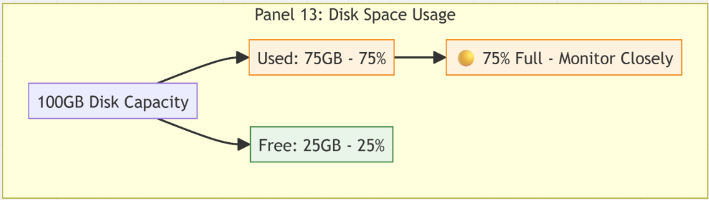

**Numerical Example**: With a 100GB disk where 25GB is available, the calculation would be: (((100 - 25)GB ÷ 100GB) × 100) = 100 - 25 = 75% disk usage. This means 75GB is used and 25GB is free.

**What it means**: This shows how much of your storage capacity is currently being used by files, databases, logs, and other data. It indicates how close you are to running out of disk space, which can cause applications to crash when they can't write new data.

### Panel 14: Disk Read MB/s
```promql
rate(node_disk_read_bytes_total[5m]) / 1024 / 1024
```

**PromQL Explanation**: This query uses the `node_disk_read_bytes_total` counter that tracks cumulative bytes read from disk since system boot. The `rate()` function calculates bytes per second over 5 minutes, then division by 1024 twice converts bytes to megabytes (1024 bytes = 1KB, 1024 KB = 1MB).

**How it's calculated**: The system counts total bytes read from disk over 5 minutes, calculates the per-second rate, then converts from bytes per second to megabytes per second by dividing by 1,048,576 (1024²).

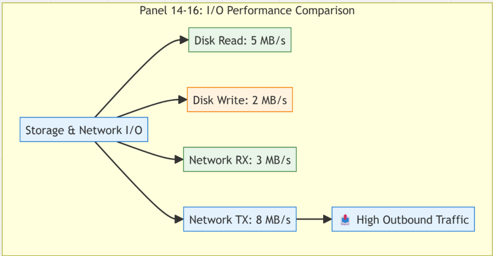

**Numerical Example**: If 1.5GB was read from disk in 5 minutes (300 seconds), the calculation would be: (1.5GB ÷ 300 seconds) ÷ 1024² = 5,242,880 bytes/sec ÷ 1,048,576 = 5 MB/s read rate.

**What it means**: This represents how fast your applications are reading data from storage. Higher values indicate heavy database queries, file processing, or other operations that require reading large amounts of data from disk.

### Panel 15: Disk Write MB/s
```promql
rate(node_disk_written_bytes_total[5m]) / 1024 / 1024
```

**PromQL Explanation**: This query uses the `node_disk_written_bytes_total` counter that tracks cumulative bytes written to disk since system boot. The `rate()` function calculates bytes per second over 5 minutes, then division by 1024 twice converts bytes to megabytes per second.

**How it's calculated**: The system counts total bytes written to disk over 5 minutes, calculates the per-second rate, then converts from bytes per second to megabytes per second using the same conversion as disk reads.

**Numerical Example**: If 600MB was written to disk in 5 minutes (300 seconds), the calculation would be: (600MB ÷ 300 seconds) = 2 MB/s write rate.

**What it means**: This shows how fast your applications are writing data to storage, including database inserts/updates, log files, temporary files, and other write operations. High values indicate heavy write activity that might impact system performance.

### Panel 16: Network RX MB/s
```promql
rate(node_network_receive_bytes_total{device!="lo"}[5m]) / 1024 / 1024
```

**PromQL Explanation**: This query uses `node_network_receive_bytes_total` counter with a label filter `{device!="lo"}` to exclude the loopback interface. The `rate()` function calculates bytes per second over 5 minutes, then division by 1024 twice converts to megabytes per second.

**How it's calculated**: The system counts bytes received on all network interfaces (excluding loopback) over 5 minutes, calculates the per-second rate, then converts from bytes per second to megabytes per second for easier interpretation.


**Numerical Example**: If 900MB was received over all network interfaces in 5 minutes (300 seconds), the calculation would be: (900MB ÷ 300 seconds) = 3 MB/s receive rate.

**What it means**: This shows how much data your server is receiving from the network, including user requests, API calls, file uploads, database replication, and other incoming network traffic.

## **Performance & Database Metrics**

### Panel 17: Request Latency (P90/P99) - Timeseries
```promql
# P90 Latency
histogram_quantile(0.90, rate(http_request_duration_seconds_bucket[5m]))

# P99 Latency  
histogram_quantile(0.99, rate(http_request_duration_seconds_bucket[5m]))
```

**PromQL Explanation**: These queries use histogram data stored in buckets (`http_request_duration_seconds_bucket`) to calculate percentiles. The `rate()` function normalizes histogram buckets over 5 minutes, then `histogram_quantile()` calculates the 90th and 99th percentiles, representing response times that 90% and 99% of requests complete within.

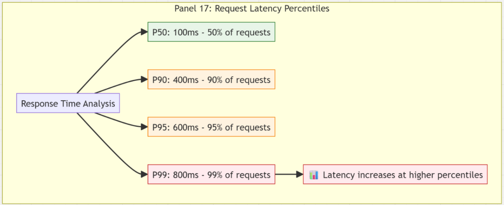

**How it's calculated**: The system collects response time measurements for all requests over 5 minutes, organizes them into histogram buckets, then calculates percentile values. P90 finds the response time where 90% of requests were faster, P99 finds where 99% were faster.

**Numerical Example**: From 1000 requests with response times ranging from 50ms to 2000ms, if P90 = 400ms and P99 = 800ms, this means 90% of users experienced response times under 400ms, and 99% experienced times under 800ms.

**What it means**: These metrics show response time distribution over time. P90 represents typical user experience, while P99 shows the worst experience that most users encounter. Trends indicate whether performance is improving or degrading.

### Panel 18: DB Query Latency P90 - Timeseries
```promql
# Insert Operations P90
histogram_quantile(0.90, rate(db_query_duration_seconds_bucket{operation="insert"}[5m]))

# Select Operations P90
histogram_quantile(0.90, rate(db_query_duration_seconds_bucket{operation="select"}[5m]))
```

**PromQL Explanation**: These queries use database-specific histogram metrics with operation labels to separate INSERT and SELECT query performance. The `{operation="insert"}` and `{operation="select"}` filters isolate different query types, while `histogram_quantile(0.90, ...)` calculates the 90th percentile latency for each operation type.


**How it's calculated**: The application measures execution time for each database query, categorizes them by operation type (INSERT, SELECT, UPDATE, DELETE), stores them in histogram buckets, then calculates the 90th percentile latency for each operation type over 5-minute windows.

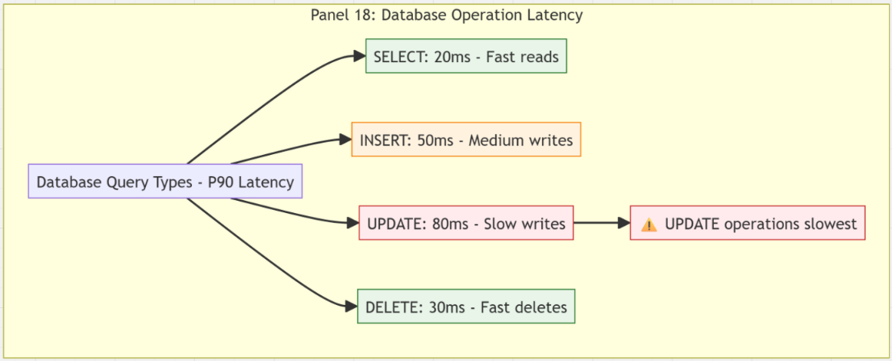

**Numerical Example**: If INSERT operations over 5 minutes had P90 latency of 50ms and SELECT operations had P90 latency of 20ms, this means 90% of INSERT operations completed within 50ms and 90% of SELECT operations completed within 20ms.

**What it means**: This shows database performance characteristics for different types of operations. INSERT/UPDATE operations typically take longer than SELECT operations because they involve writing data and maintaining indexes, while SELECT operations only read data.

## **System Resources (CPU & Memory) - Timeseries**

### Panel 19: CPU Usage - Timeseries
```promql
100 - (avg(rate(node_cpu_seconds_total{mode="idle"}[5m])) * 100)
```

**PromQL Explanation**: This is identical to Panel 5's calculation but displayed as a time-series chart instead of a single stat. It shows CPU usage percentage over time by calculating non-idle CPU time as a percentage of total CPU time, averaged across all cores.

**How it's calculated**: Same calculation as Panel 5, but Grafana displays the results as a line chart showing how CPU usage changes over time rather than just the current value. This allows visualization of CPU usage patterns and trends.

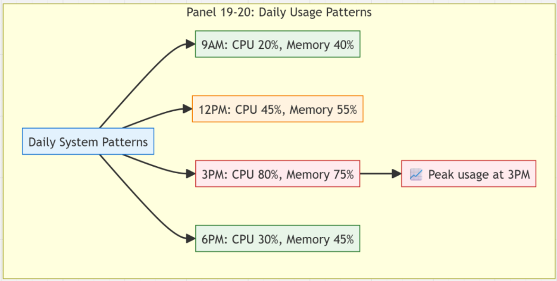

**Numerical Example**: The chart might show CPU usage starting at 20% at 9:00 AM, rising to 80% during peak hours at 2:00 PM, then dropping to 30% by 6:00 PM, revealing daily usage patterns.

**What it means**: This visualization reveals CPU usage patterns over time, showing how system load correlates with business hours, traffic patterns, or scheduled tasks. It helps identify regular patterns versus anomalies.

### Panel 20: Memory Usage - Timeseries
```promql
100 * (1 - ((node_memory_MemAvailable_bytes or node_memory_MemFree_bytes) / node_memory_MemTotal_bytes))
```

**PromQL Explanation**: This uses the same calculation as Panel 9 but displays memory usage percentage over time as a line chart. It shows how memory consumption changes over time, revealing trends, patterns, and potential memory leaks.

**How it's calculated**: Same calculation as Panel 9, but displayed as a time-series visualization showing memory usage percentage over time rather than just the current snapshot value.


**Numerical Example**: The chart might show memory usage starting at 40% in the morning, gradually increasing to 85% by afternoon, then either staying high (indicating a memory leak) or dropping back to 40% (indicating normal usage patterns).

**What it means**: This reveals memory usage patterns over time, helping identify whether high memory usage is normal traffic-related growth or potentially problematic trends like memory leaks where usage continuously increases without decreasing.

## **Network & Advanced Metrics - Timeseries**

### Panel 21: Network RX/TX Pressure
```promql
# Network Receive
rate(node_network_receive_bytes_total{device!="lo"}[5m]) / 1024 / 1024

# Network Transmit
rate(node_network_transmit_bytes_total{device!="lo"}[5m]) / 1024 / 1024
```

**PromQL Explanation**: These queries track both incoming (RX) and outgoing (TX) network traffic using separate counters. The `{device!="lo"}` filter excludes loopback traffic, `rate()` calculates MB/s over 5 minutes, and both metrics are displayed on the same chart to show bidirectional network usage patterns.

**How it's calculated**: The system tracks bytes received and transmitted on all network interfaces (excluding loopback), calculates per-second rates over 5-minute windows, converts to megabytes per second, and displays both directions on a single time-series chart.

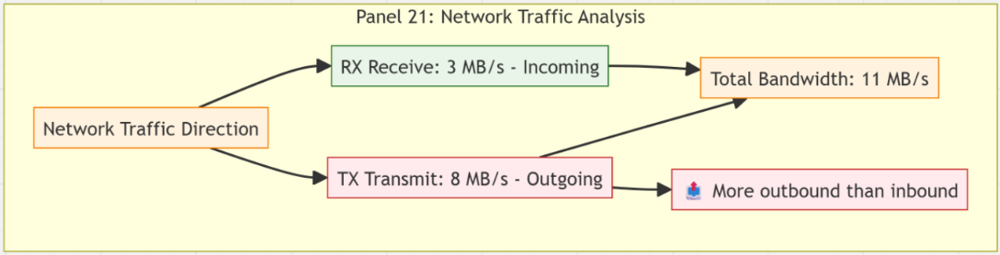

**Numerical Example**: A chart might show RX traffic at 5 MB/s during file uploads (high incoming) and TX traffic at 15 MB/s during report generation (high outgoing), revealing different usage patterns for different application activities.

**What it means**: This shows bidirectional network usage patterns over time, revealing whether your application is more upload-heavy (high RX) or download-heavy (high TX), and how network usage correlates with user activity or scheduled tasks.

### Panel 22: CPU Throttling & Load
```promql
# CPU Steal Time (Virtualization Throttling)
rate(node_cpu_seconds_total{mode="steal"}[5m])

# Load Average 1 minute
node_load1

# Load Average 5 minutes  
node_load5
```

**PromQL Explanation**: This panel combines three different CPU-related metrics: steal time (CPU cycles taken by hypervisor), 1-minute load average, and 5-minute load average. These provide different perspectives on CPU performance and system demand in virtualized environments.

**How it's calculated**: Steal time calculates per-second rate of CPU cycles stolen by the hypervisor over 5 minutes. Load averages are direct kernel measurements of system demand over 1 and 5-minute windows, showing both short-term and medium-term system stress.

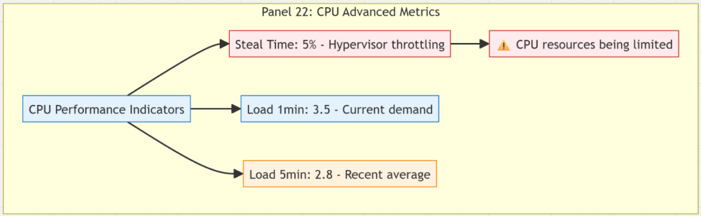

**Numerical Example**: The chart might show 5% steal time during peak hours (indicating hypervisor throttling), load1 = 3.5 (short-term high demand), and load5 = 2.8 (medium-term moderate demand) on a 4-core system, indicating temporary overload conditions.

**What it means**: Steal time indicates if your virtual machine isn't getting the CPU resources you're paying for due to hypervisor limitations. Load averages show system demand over different time horizons, helping distinguish between temporary spikes and sustained high demand.

### Panel 23: Error Rates
```promql
# 5xx Server Errors
100 * (sum(rate(http_requests_total{status_code=~"5.."}[5m])) / sum(rate(http_requests_total[5m]))

# 4xx Client Errors
100 * (sum(rate(http_requests_total{status_code=~"4.."}[5m])) / sum(rate(http_requests_total[5m]))
```

**PromQL Explanation**: These queries separate HTTP errors into server errors (5xx status codes) and client errors (4xx status codes) using regex pattern matching. Each calculates what percentage of total requests result in each error type, providing insight into different types of application problems.

**How it's calculated**: The system counts HTTP responses with 5xx status codes (server errors like 500, 502, 503) and 4xx status codes (client errors like 400, 401, 404) over 5 minutes, then calculates what percentage each represents of total HTTP requests.

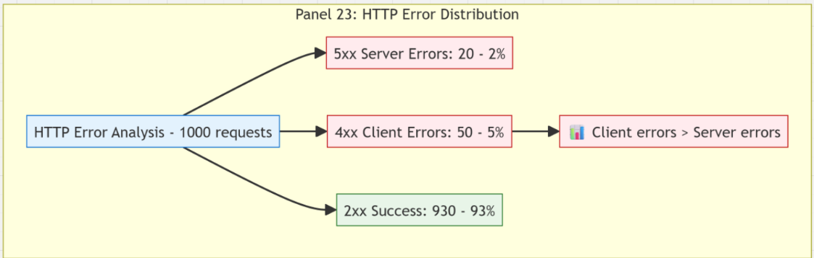

**Numerical Example**: From 1000 total requests, if 20 returned 5xx errors and 50 returned 4xx errors, the calculations would be: 5xx error rate = (20 ÷ 1000) × 100 = 2%, 4xx error rate = (50 ÷ 1000) × 100 = 5%.

**What it means**: 5xx errors indicate server-side problems like application bugs, database failures, or infrastructure issues that you need to fix. 4xx errors indicate client-side problems like invalid requests, authentication failures, or requests for non-existent resources.

## Conclusion


### Summary

#### Row 1: Application Health
- **Panel 1:** Availability % (Single Stat)
- **Panel 2:** Total RPS (Single Stat)
- **Panel 3:** P99 Latency (Single Stat)
- **Panel 4:** Active DB Connections (Single Stat)

#### Row 2: Performance Trends
- **Panel 1:** Request Latency Over Time (Graph - P90, P95, P99)
- **Panel 2:** Requests Per Second (Graph)

#### Row 3: Database Performance
- **Panel 1:** DB Query Latencies (Graph - Insert/Select P90)
- **Panel 2:** DB Operations Rate (Graph)

#### Row 4: System Resources
- **Panel 1:** CPU Usage (Graph)
- **Panel 2:** Memory Usage (Graph)
- **Panel 3:** Network I/O (Graph)

#### Row 5: Advanced Metrics
- **Panel 1:** Load Average (Graph)
- **Panel 2:** Disk I/O (Graph)
- **Panel 3:** Error Rates (Graph)

### Panel Colors & Styling
- **Green:** Good performance metrics
- **Yellow:** Warning thresholds
- **Red:** Critical thresholds
- **Blue:** Informational metrics


The combination of system-level metrics (Node Exporter) and application-level metrics (custom instrumentation) provides complete observability into both infrastructure performance and application behavior, enabling proactive monitoring and rapid troubleshooting of performance issues.